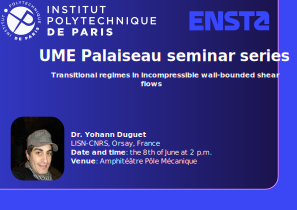
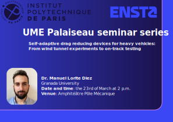

##  &nbsp; Archive of past seminars

::::: {.talk-card}
### 8th of June 2026 

**Title:** Emergence of laminar-turbulent patterns in plane channel flow
  
**Speaker:** Dr. Yohann Duguet

{width="50%" fig-align="center"}

::: {.button}
[<iconify-icon icon="fa-solid:chalkboard" aria-label="Announcement"></iconify-icon> Announcement](Resources/Documents/2026/Y_Duguet.pdf){.button target="_blank"}
:::

:::::

::::: {.talk-card}
### 11th of May 2026 

**Title:** Multi-material constitutive learning in hyperelasticity
  
**Speaker:** Dr. Clément Jailin

{width="50%" fig-align="center"}

::: {.button}
[<iconify-icon icon="fa-solid:chalkboard" aria-label="Announcement"></iconify-icon> Announcement](Resources/Documents/2026/C_Jailin.pdf){.button target="_blank"}
:::

:::::

::::: {.talk-card}
### 23rd of March 2026 

**Title:** Self-adaptive drag reducing devices for heavy vehicles: From wind tunnel experiments to on-track testing 
  
**Speaker:** Dr. Manuel Lorite Diez 

{width="50%" fig-align="center"}

::: {.button}
[<iconify-icon icon="fa-solid:chalkboard" aria-label="Announcement"></iconify-icon> Announcement](Resources/Documents/2026/M_Diez.pdf){.button target="_blank"}
:::

:::::

::::: {.talk-card}
### 19th of March 2026 

**Title:** Technological challenges for deep-water steel pipeline construction; a structural mechanics perspective
  
**Speaker:** Pr. Spyros A. Karamanos 

::: {.button}
[<iconify-icon icon="fa-solid:chalkboard" aria-label="Announcement"></iconify-icon> Announcement](Resources/Documents/2026/S_Karamanos.pdf){.button target="_blank"}
:::

:::::

