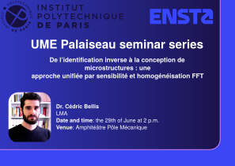
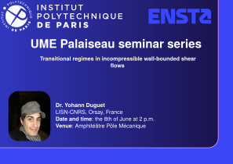
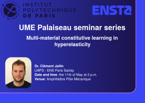
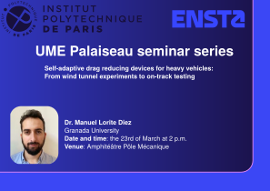

#  &nbsp; Archive of past seminars

## 2026 - 2027

## 2025 - 2026

::::: {.talk-card}
### Cédric Bellis

**Title:** De l’identification inverse à la conception de microstructures : une approche unifiée par sensibilité et homogénéisation FFT
 
**Date:** 29/06/26
  

{width="50%" fig-align="center"}

::: {.button}
[<iconify-icon icon="fa-solid:chalkboard" aria-label="Announcement"></iconify-icon> Announcement](Resources/Documents/2026/C_Bellis.pdf){.button target="_blank"}
:::

:::::

::::: {.talk-card}
### Laura De Lorenzis

**MECA Seminar of Institut Polytechnique de Paris**

**Title:** Recent results on variational phase-field modeling of cohesive fracture

**Date:** 25/06/26
  

{width="50%" fig-align="center"}

:::: {.columns}

::: {.column width="130pt"}

::: {.button}
[<iconify-icon icon="fa-solid:chalkboard" aria-label="Announcement"></iconify-icon> Announcement](Resources/Documents/2026/L_de_Lorenzis.pdf){.button target="_blank"}
:::

:::

::: {.column width="80pt"}

::: {.button}
[<iconify-icon icon="fa-solid:chalkboard" aria-label="Announcement"></iconify-icon> Poster](Resources/Documents/2026/L_De_Lorenzis_helv.pdf){.button target="_blank"}
:::

:::

::::

:::::

::::: {.talk-card}
### Yohann Duguet

**Title:** Emergence of laminar-turbulent patterns in plane channel flow
 
**Date:** 08/06/26
  

{width="50%" fig-align="center"}

::: {.button}
[<iconify-icon icon="fa-solid:chalkboard" aria-label="Announcement"></iconify-icon> Announcement](Resources/Documents/2026/Y_Duguet.pdf){.button target="_blank"}
:::

:::::

::::: {.talk-card}
### Clément Jailin

**Title:** Multi-material constitutive learning in hyperelasticity
 
**Date:** 11/05/26
  

{width="50%" fig-align="center"}

::: {.button}
[<iconify-icon icon="fa-solid:chalkboard" aria-label="Announcement"></iconify-icon> Announcement](Resources/Documents/2026/C_Jailin.pdf){.button target="_blank"}
:::

:::::

::::: {.talk-card}
### Manuel Lorite Diez 

**Title:** Self-adaptive drag reducing devices for heavy vehicles: From wind tunnel experiments to on-track testing 
 
**Date:** 23/03/26
  

{width="50%" fig-align="center"}

::: {.button}
[<iconify-icon icon="fa-solid:chalkboard" aria-label="Announcement"></iconify-icon> Announcement](Resources/Documents/2026/M_Diez.pdf){.button target="_blank"}
:::

:::::

::::: {.talk-card}
### Spyros A. Karamanos 

**Title:** Technological challenges for deep-water steel pipeline construction; a structural mechanics perspective
 
**Date:** 19/03/26
  

::: {.button}
[<iconify-icon icon="fa-solid:chalkboard" aria-label="Announcement"></iconify-icon> Announcement](Resources/Documents/2026/S_Karamanos.pdf){.button target="_blank"}
:::

:::::

