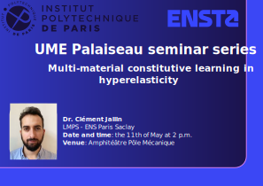

##  &nbsp; Welcome to UME seminar series !

This wiki serves as a central hub for the **UME** seminar series at ENSTA, Palaiseau. 

Organisers: Camilla Zolesi (camilla.zolesi[at]ensta-paris.fr) & [Alexandre Daby-Seesaram](https://alexandredabyseesaram.github.io/) (alexandre.daby-seesaram[at]ensta-paris.fr)

## Upcoming seminar(s) 

::::: {.talk-card}
### 11th of May 2026 

**Title:** Multi-material constitutive learning in hyperelasticity
  
**Speaker:** Dr. Clément Jailin

{width="50%" fig-align="center"}

::: {.button}
[<iconify-icon icon="fa-solid:chalkboard" aria-label="Announcement"></iconify-icon> Announcement](Resources/Documents/2026/C_Jailin.pdf){.button target="_blank"}
:::

:::::

