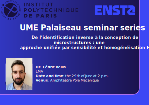

##  &nbsp; Welcome to UME seminar series !

This wiki serves as a central hub for the **UME** seminar series at ENSTA, Palaiseau. 

Organisers: Camilla Zolesi (camilla.zolesi[at]ensta-paris.fr) & [Alexandre Daby-Seesaram](https://alexandredabyseesaram.github.io/) (alexandre.daby-seesaram[at]ensta-paris.fr)

## Upcoming seminar(s) 

::::: {.talk-card}
### 25th of June 2026 - MECA Seminar of Institut Polytechnique de Paris

**Title:** Recent results on variational phase-field modeling of cohesive fracture
  
**Speaker:** Pr. Laura De Lorenzis

{width="50%" fig-align="center"}

:::: {.columns}

::: {.column width="50%"}

::: {.button}
[<iconify-icon icon="fa-solid:chalkboard" aria-label="Announcement"></iconify-icon> Announcement](Resources/Documents/2026/L_de_Lorenzis.pdf){.button target="_blank"}
:::

:::

::: {.column width="50%"}

::: {.button}
[<iconify-icon icon="fa-solid:chalkboard" aria-label="Announcement"></iconify-icon> Poster](Resources/Documents/2026/L_De_Lorenzis_helv.pdf){.button target="_blank"}
:::

:::

::::

:::::

::::: {.talk-card}
### 29th of June 2026 

**Title:** De l’identification inverse à la conception de microstructures : une approche unifiée par sensibilité et homogénéisation FFT
  
**Speaker:** Dr. Cédric Bellis

{width="50%" fig-align="center"}

::: {.button}
[<iconify-icon icon="fa-solid:chalkboard" aria-label="Announcement"></iconify-icon> Announcement](Resources/Documents/2026/C_Bellis.pdf){.button target="_blank"}
:::

:::::

