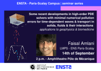

##  &nbsp; Welcome to UME seminar series !

This wiki serves as a central hub for the **UME** seminar series at ENSTA, Palaiseau. 

Organisers: Camilla Zolesi (camilla.zolesi[at]ensta-paris.fr) & [Alexandre Daby-Seesaram](https://alexandredabyseesaram.github.io/) (alexandre.daby-seesaram[at]ensta-paris.fr)

## Upcoming seminar(s) 

::::: {.talk-card}
### 14th of September 2026 

**Title:** Some recent high-order solvers with minimal pollution errors for hemodynamic wave propagation 

  
**Speaker:** Dr. Faisal Amlani

{width="50%" fig-align="center"}

<!-- ::: {.button}
[<iconify-icon icon="fa-solid:chalkboard" aria-label="Announcement"></iconify-icon> Announcement](Resources/Documents/2026/C_Bellis.pdf){.button target="_blank"}
::: -->

:::::

